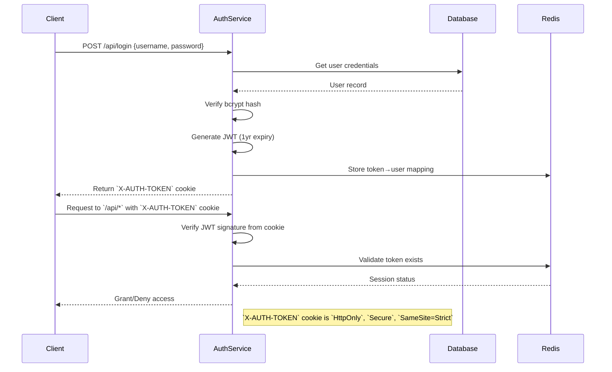

# Authentication System Documentation

## Architecture Overview


### Core Components

| Component           | Location                              | Responsibility                        |
| ------------------- | ------------------------------------- | ------------------------------------- |
| JWT Service         | `src/routes/auth.rs`                  | Token generation/validation           |
| Redis Session Store | `src/utils/redis_credentials_repo.rs` | Active session management             |
| User Model          | `src/models/users.rs`                 | Password storage & validation         |
| Auth Middleware     | `src/routes/auth.rs`                  | Request validation & role enforcement |

## Sequence Flow



## Security Implementation

```rust
// Key security features in code
#[derive(Validator)]
#[validator(regex(regex::USERNAME_REG))]
pub struct Username(String);  // Enforces username format

#[derive(Validator)]
#[validator(line(char_length(max = 200)))]
pub struct Password(String);  // Password length constraint

impl fmt::Debug for Password {
    fn fmt(&self, f: &mut fmt::Formatter) -> fmt::Result {
        f.write_str("**********")  // Mask passwords in logs
    }
}
```

### Session Management

- JWT Claims Structure:
  ```rust
  #[derive(Serialize, Deserialize)]
  pub struct VerifiedAuthDetails {
      pub user_id: UserId,
      pub username: Username,
      pub roles: Vec<RoleEnum>,  // Role-based access control
  }
  ```
- Redis Storage Format:

  ```rust
  credentials_repo.save(&user.id, &token, ttl_seconds)  // user_id → token mapping
  ```

  With the changes we've made:

- **JWT Token TTL**: The JWT token itself is now set to expire after 30 days. This is the maximum lifespan of the token.
- **Redis Session TTL (on validation)**: Every time the validate_token function is called (meaning the user is actively using the application and sending requests with their token), the session TTL in Redis is refreshed to 30 minutes.
- **Redis Session Initial TTL (on login)**: When a user logs in, the Redis session is initially set to expire after 24 hours.

The Redis session refresh mechanism is now effective within the 30-day lifespan of the JWT token. As long as a user is active within each 30-minute window (making requests that trigger token validation), their session in Redis will be refreshed, and they will remain logged in, up to the 30-day JWT token expiration.

If a user becomes inactive for more than 30 minutes, the Redis session TTL will not be refreshed during that time. However, the session will still be valid as long as it's within the 24-hour initial TTL (from login) and, more importantly, as long as the JWT token itself is not expired (within 30 days).

In essence:

The 30-day JWT TTL is the absolute maximum token validity.
The 30-minute Redis session refresh ensures that as long as the user is active, their session is extended in Redis, up to the 30-day JWT limit.
The 24-hour initial Redis TTL provides a fallback session timeout after login, before the refresh mechanism takes over.

## Recommended Improvements

```rust
// Suggested security enhancements
const TOKEN_EXPIRATION: Duration = Duration::from_days(30); // Reduced from 365
const MAX_LOGIN_ATTEMPTS: u8 = 5; // Add account lockout
```

| Security Control    | Status | Recommendation               |
| ------------------- | ------ | ---------------------------- |
| Token TTL           | ✅     | Implement TTL                |
| Token Rotation      | ❌     | Implement refresh tokens     |
| Password Complexity | ❌     | Add complexity rules         |
| Rate Limiting       | ❌     | Add login attempt throttling |
