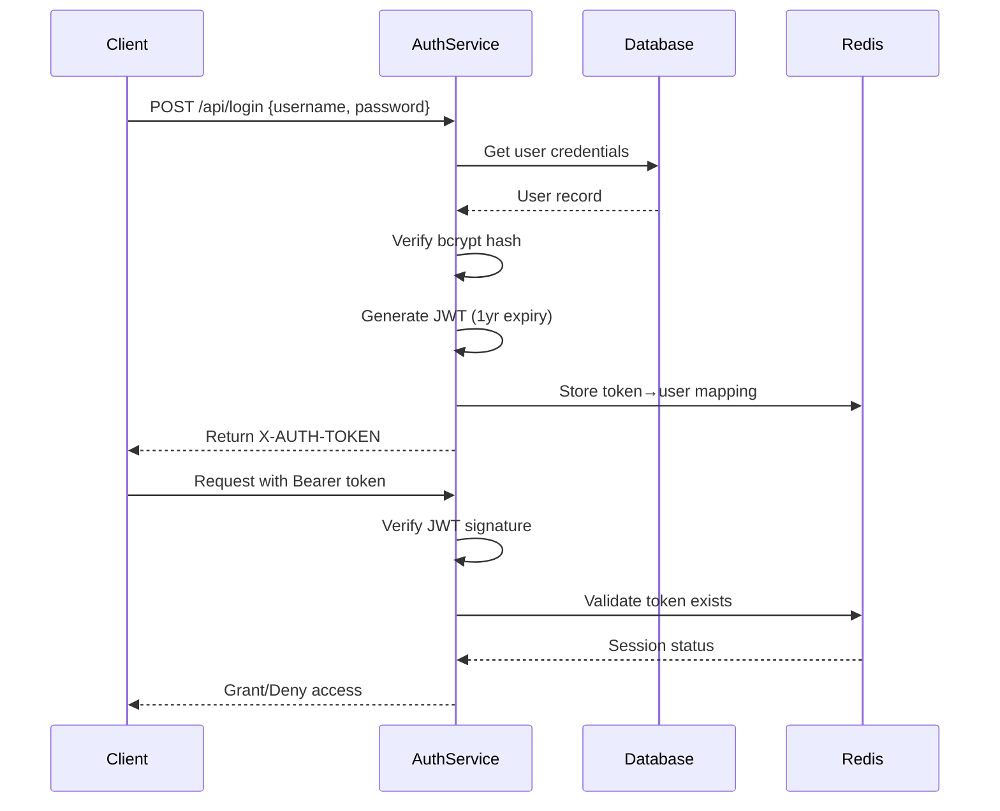

# Authentication System Documentation

## Architecture Overview


### Core Components

| Component           | Location                              | Responsibility                        |
| ------------------- | ------------------------------------- | ------------------------------------- |
| JWT Service         | `src/routes/auth.rs`                  | Token generation/validation           |
| Redis Session Store | `src/utils/redis_credentials_repo.rs` | Active session management             |
| User Model          | `src/models/users.rs`                 | Password storage & validation         |
| Auth Middleware     | `src/routes/auth.rs`                  | Request validation & role enforcement |

## Sequence Flow



## Security Implementation

```rust
// Key security features in code
#[derive(Validator)]
#[validator(regex(regex::USERNAME_REG))]
pub struct Username(String);  // Enforces username format

#[derive(Validator)]
#[validator(line(char_length(max = 200)))]
pub struct Password(String);  // Password length constraint

impl fmt::Debug for Password {
    fn fmt(&self, f: &mut fmt::Formatter) -> fmt::Result {
        f.write_str("**********")  // Mask passwords in logs
    }
}
```

### Session Management

- JWT Claims Structure:
  ```rust
  #[derive(Serialize, Deserialize)]
  pub struct VerifiedAuthDetails {
      pub user_id: UserId,
      pub username: Username,
      pub roles: Vec<RoleEnum>,  // Role-based access control
  }
  ```
- Redis Storage Format:
  ```rust
  credentials_repo.save(&user.id, &token)  // user_id → token mapping
  ```

## Recommended Improvements

```rust
// Suggested security enhancements
const TOKEN_EXPIRATION: Duration = Duration::from_days(30); // Reduced from 365
const MAX_LOGIN_ATTEMPTS: u8 = 5; // Add account lockout
```

| Security Control    | Status | Recommendation               |
| ------------------- | ------ | ---------------------------- |
| Token Rotation      | ❌     | Implement refresh tokens     |
| Password Complexity | ❌     | Add complexity rules         |
| Rate Limiting       | ❌     | Add login attempt throttling |
